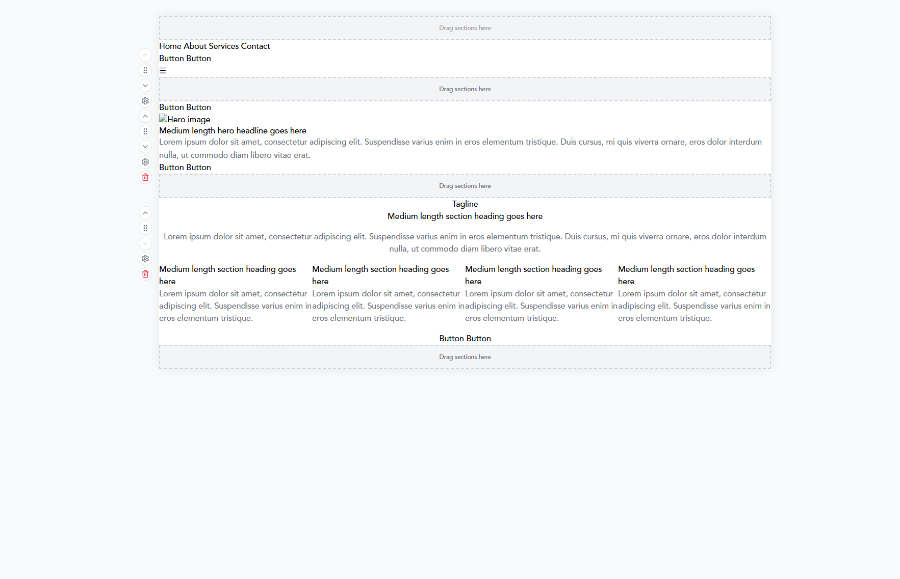

# PageBuilder Styling Fix Plan

> **Status**: Phase 1 COMPLETED ✅ - PageBuilder is now stable and working! See [Progress Update](#progress-update-2025-07-21) below.

## Problem Overview (RESOLVED)

The PageBuilder was experiencing a critical styling issue where:
1. Correct styles briefly flashed on screen when loading
2. The page then reverted to completely unstyled HTML
3. This created a poor user experience and broke the visual editing capabilities

**Status**: This issue has been resolved in Phase 1 by removing TemplatePreview from Edit Mode.

## Root Cause Analysis

### The Dual Styling System

Our architecture currently has two parallel styling systems that are conflicting:

1. **React/Interactive System (CSS Variables)**
   - Used for live editing in the PageBuilder
   - Flow: Database → `applySiteStyleVariables()` → CSS Variables on `document.documentElement` → React Components
   - Components like `EditableText`, `EditableButton` read CSS variables directly
   - Provides immediate visual feedback during editing

2. **Static/Template System (Generated CSS)**
   - Used for sections that only have HTML templates (no React components)
   - Flow: Database → `generateTemplateCSS()` → Injected `<style>` element → HTML Templates
   - `TemplatePreview` component bridges static templates into React environment
   - Ensures preview matches what will be deployed to Netlify

### Why We Have Both Systems

This dual architecture exists for good reasons:
- **PageBuilder needs React interactivity** for live editing
- **Deployed sites are static HTML** without React
- **TemplatePreview bridges both worlds** to show accurate previews

### The Race Condition

The styling flash occurs because:
1. PageBuilder loads and fetches styles from database
2. Applies styles via `applySiteStyleVariables()` to document (correct styles show)
3. `CSSSiteStylesProvider` tries to read CSS variables from DOM
4. `TemplatePreview` components mount and generate their own CSS
5. The injected styles from TemplatePreview override the CSS variables (styles break)

Both systems are trying to control styling simultaneously, creating a race condition.

## Business Requirements

- **Bulletproof reliability** - System must not break or flash
- **Scale to hundreds of templates** - New sections added continuously
- **Scale to hundreds of projects** - Each with unique styling
- **Customer satisfaction** - Consistent, professional experience
- **Do it right once** - No patches on patches

## Proposed Solution: Mode-Based Architecture

### Core Principle: Single Source of Truth

Instead of two systems fighting for control, implement clear modes where only one system is active at a time.

### The Three Modes

1. **Edit Mode** (Default)
   - Uses React components exclusively
   - CSS variables control all styling
   - Live editing with immediate feedback
   - NO TemplatePreview components rendered

2. **Preview Mode** (Toggle)
   - Shows exact static HTML that will be deployed
   - No React components or interactivity
   - Uses the same template rendering as deployment
   - 100% accurate preview of final site

3. **Deployed Mode** (Netlify)
   - Pure static HTML + CSS files
   - No JavaScript framework
   - Optimized for performance

### Key Benefits

- **No race conditions** - Only one styling system active per mode
- **Perfect preview accuracy** - Preview mode shows actual deployment
- **Infinite scalability** - Clear separation simplifies adding templates
- **Bulletproof reliability** - No conflicting systems
- **Clear mental model** - Like Google Docs edit vs print preview

## Implementation Plan

### Phase 1: Stabilize Current System ✅ COMPLETED
**Goal**: Stop the styling flash while we implement the full solution

~~1. Modify `TemplatePreview` to wait for styles before rendering~~
~~2. Add loading state to prevent unstyled content flash~~
~~3. Ensure CSS generation only happens after styles are loaded~~
~~4. Document the temporary fix~~

**Note**: We took a different approach - see Progress Update below

### Phase 2: Implement Mode System (Core Architecture)
**Goal**: Create the infrastructure for mode switching

1. Add mode state to PageBuilder (`edit` | `preview`)
2. Create mode toggle UI (button in toolbar)
3. Implement mode context provider
4. Set up conditional rendering based on mode

### Phase 3: Refactor Section Rendering (Major Change)
**Goal**: Separate edit and preview rendering paths

1. Create `SectionRenderer` component that checks mode
2. In Edit Mode: Render React components only
3. In Preview Mode: Render static HTML only
4. Ensure all sections have both representations

### Phase 4: Section Management Strategy
**Goal**: Maintain clear separation between approved components and templates

1. Continue using only the 3 approved React components in Edit Mode
2. New sections must go through the established approval process
3. Template-only sections will be visible in Preview Mode only
4. Document the section approval workflow

### Phase 5: Testing & Polish
**Goal**: Ensure bulletproof reliability

1. Test mode switching performance
2. Verify preview matches deployment exactly
3. Test with multiple projects/styles
4. Add error boundaries and fallbacks
5. Performance optimization

### Phase 6: Documentation & Training
**Goal**: Ensure maintainability

1. Document the new architecture
2. Update developer guidelines
3. Create examples for new sections
4. Migration guide for existing code

## Progress Update (2025-07-21)

### Phase 1: COMPLETED ✅
**What we planned**: Fix the race condition by improving TemplatePreview timing and CSS loading synchronization.

**What we actually did**: Removed TemplatePreview from Edit Mode entirely, achieving complete separation of concerns.

**Changes made**:
1. **Moved TemplatePreview.tsx** from `/components/sections/` to `/components/template/`
   - It's not a section component, so it shouldn't be in the sections folder
   
2. **Modified PageBuilder's renderSection**:
   - Removed all TemplatePreview usage in Edit Mode
   - Now only uses the 3 approved React components: HeroSplitLayout, FourFeaturesGrid, NavigationDesktop
   
3. **Created TemplateSectionPlaceholder**:
   - Shows a clean placeholder for any section types that don't have React components
   - Informs users to use Preview Mode to see template-based content
   
4. **Removed template fetching logic**:
   - Deleted `fetchTemplates` function and related state
   - Removed imports for `fetchSectionTemplate` and `hasHtmlTemplate`
   - Cleaned up `sectionTemplates` state management

**Result**: 
- ✅ PageBuilder is now stable and fully functional
- ✅ No more styling conflicts or flashing
- ✅ Clean separation between Edit Mode (React only) and future Preview Mode (templates)
- ✅ Users can interact with all approved sections properly

### Lessons Learned from Phase 1
1. **The simplest solution was the best**: Complete separation rather than trying to fix timing issues
2. **Mixing systems creates complexity**: TemplatePreview was injecting global CSS that affected the entire PageBuilder
3. **Approved components only**: Having only the 3 approved components in Edit Mode improves control and predictability
4. **Architecture clarity**: The mode-based approach is the right direction - we just implemented it earlier than planned

### Important Note on Section Components
Only the following React components are approved for use in Edit Mode:
- `HeroSplitLayout` - Hero sections
- `FourFeaturesGrid` - Feature sections  
- `NavigationDesktop` - Navigation sections

New sections must go through the established approval process before being added to Edit Mode. Template-only sections will be available in Preview Mode once implemented.

### Next Steps
Ready to proceed with **Phase 2: Implement Mode System**. The foundation is now solid with clean separation between React components (Edit Mode) and templates (future Preview Mode).

## Technical Implementation Details

### What Changes

1. **PageBuilder.tsx**
   - Add mode state and toggle
   - Conditional rendering based on mode
   - Mode persistence in localStorage

2. **Section Components**
   - Create new `SectionRenderer` wrapper
   - Mode-aware rendering logic
   - Only approved React components used in Edit Mode

3. **TemplatePreview**
   - Only used in Preview Mode
   - No longer mixed with React components
   - Simplified logic without race conditions

### What Stays The Same

1. **Database schema** - No changes needed
2. **Style storage** - Same format and fields
3. **Deployment process** - Still generates static sites
4. **Template system** - HTML templates unchanged
5. **React components** - Existing components work as-is

### Implementation Approach

1. Build Preview Mode on top of current stable Edit Mode
2. No migration needed - clean separation already achieved
3. Users continue working with no disruption

## Success Metrics

1. **Zero styling flashes** - Measured by user reports
2. **Preview accuracy** - 100% match with deployment
3. **Performance** - Mode switch < 100ms
4. **Reliability** - Zero styling-related bugs
5. **Developer velocity** - New sections added without styling issues

## Risks and Mitigations

### Risk 1: Mode Switching Performance
- **Mitigation**: Optimize rendering, use React.memo
- **Fallback**: Show loading indicator during switch

### Risk 2: User Confusion with Modes
- **Mitigation**: Clear UI indicators, tooltips
- **Fallback**: Default to edit mode, make preview optional

### Risk 3: Section Type Limitations
- **Mitigation**: Clear documentation on approved components
- **Fallback**: Placeholder shows for unapproved sections

## Long-term Vision

This architecture sets us up for:
1. **Advanced preview features** - Device frames, responsive views
2. **Collaboration** - Different modes for different user roles
3. **Performance optimization** - Lazy load modes as needed
4. **A/B testing** - Preview variants before deployment
5. **Template marketplace** - Clear separation enables sharing

## Conclusion

By implementing a clear mode-based architecture, we solve the immediate styling issues while building a foundation that scales to hundreds of templates and thousands of projects. The key insight is that trying to mix React and static rendering in the same view creates inevitable conflicts. Separating them into distinct modes provides clarity, reliability, and infinite scalability.

The phased approach allows us to fix the immediate issue quickly while systematically building toward the complete solution. Each phase delivers value while moving toward the ultimate goal of a bulletproof, scalable website builder.